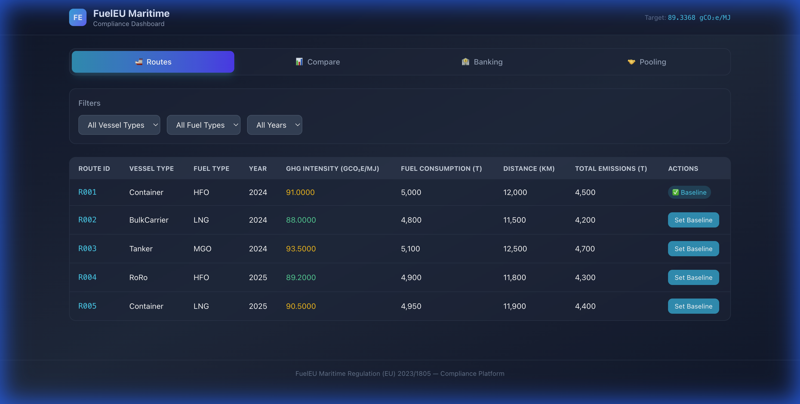
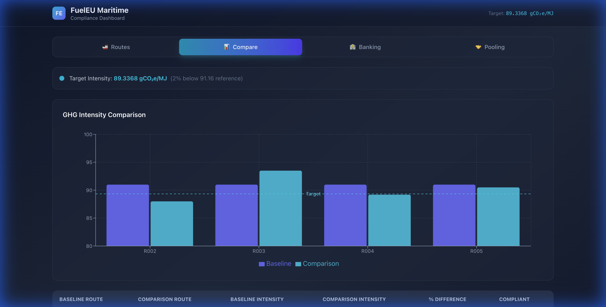
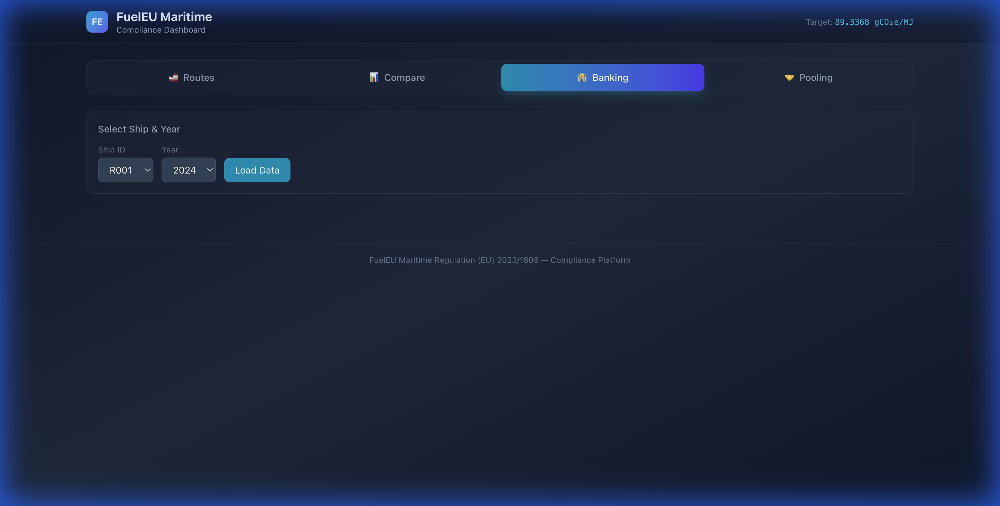
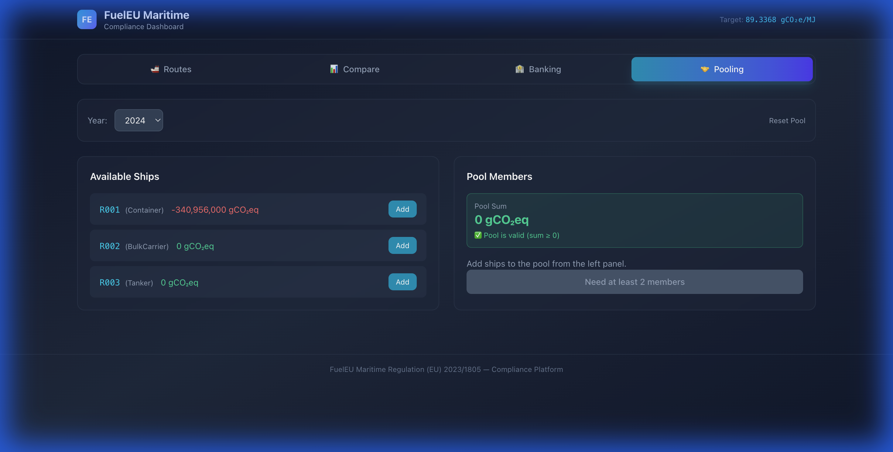

# FuelEU Maritime — Compliance Dashboard (Frontend)

A React + TypeScript frontend for managing FuelEU Maritime regulation compliance. This dashboard lets you view shipping routes, compare GHG intensities, bank compliance surpluses, and create ship pools.

Built as part of the FuelEU Maritime assignment, following hexagonal (ports & adapters) architecture.

---

## Tech Stack

- **React 19** + **TypeScript** (strict mode)
- **Vite** — build tool and dev server
- **TailwindCSS 4** — utility-first styling
- **Axios** — HTTP client for API calls
- **Recharts** — charting library for data visualization
- **Vitest** + **React Testing Library** — testing

---

## Getting Started

### Prerequisites
- Node.js 18+
- npm
- Backend server running on `http://localhost:3000`

### Install & Run

```bash
# Install dependencies
npm install

# Start development server
npm run dev
```

The app will be available at `http://localhost:5173`.

### Other Commands

```bash
npm run build        # Production build
npm run test         # Run all tests
npm run test:watch   # Run tests in watch mode
npm run lint         # Run ESLint
```

---

## Architecture (Hexagonal)

```
src/
├── core/                          # Business logic (no framework dependencies)
│   ├── domain/
│   │   ├── entities/              # Pure functions — business rules
│   │   │   ├── Route.ts           # isCompliant(), getEnergyInScope()
│   │   │   ├── ComplianceBalance.ts  # isSurplus(), isDeficit()
│   │   │   ├── BankEntry.ts       # hasBankedSurplus()
│   │   │   └── Pool.ts           # getPoolSum(), isPoolValid()
│   │   └── types/                 # TypeScript interfaces & DTOs
│   │       ├── RouteTypes.ts
│   │       ├── ComplianceTypes.ts
│   │       ├── BankingTypes.ts
│   │       └── PoolingTypes.ts
│   ├── ports/
│   │   └── outbound/              # Interfaces that adapters must implement
│   │       ├── IRouteRepository.ts
│   │       ├── IBankingRepository.ts
│   │       └── IPoolingRepository.ts
│   └── application/
│       └── usecases/              # Application logic — connects ports to entities
│           ├── routes/RouteUseCases.ts
│           ├── banking/BankingUseCases.ts
│           └── pooling/PoolingUseCases.ts
│
├── adapters/                      # External world connections
│   ├── infrastructure/
│   │   └── api/                   # Axios HTTP adapters (implement ports)
│   │       ├── apiClient.ts       # Centralized Axios instance
│   │       ├── RouteApiAdapter.ts
│   │       ├── BankingApiAdapter.ts
│   │       └── PoolingApiAdapter.ts
│   └── ui/                        # React layer
│       ├── components/            # Tab components
│       │   ├── routes/RoutesTab.tsx
│       │   ├── compare/CompareTab.tsx
│       │   ├── banking/BankingTab.tsx
│       │   └── pooling/PoolingTab.tsx
│       ├── hooks/                 # Custom React hooks
│       │   ├── useRoutes.ts
│       │   ├── useBanking.ts
│       │   └── usePooling.ts
│       └── pages/
│           └── Dashboard.tsx      # Main dashboard with tabs
│
├── shared/                        # Shared utilities
│   ├── constants/fuelConstants.ts # Target intensity, API base URL
│   └── utils/formatters.ts       # Number/CB/percentage formatters
│
└── test/                          # Test files
    ├── setup.ts
    ├── domain/                    # Entity tests
    ├── usecases/                  # Use case tests (mocked repos)
    └── shared/                    # Formatter tests
```

---

## Screenshots

### Routes Tab
Displays all shipping routes with filters (vessel type, fuel type, year). GHG intensity values are color-coded — green for compliant, amber/red for exceeding target.



### Compare Tab
Bar chart comparing baseline route against other routes. The dashed line shows the 89.3368 gCO₂e/MJ target. Below the chart is a detailed comparison table with % difference and compliance status.



### Banking Tab
Select a ship and year, then load its compliance balance. If the CB is positive (surplus), you can bank it for future use. If negative (deficit), you can apply previously banked surplus.



### Pooling Tab
Add ships to create a compliance pool. The pool sum indicator turns green when ≥ 0 (valid). After creating a pool, you can see the redistributed CB values for each member.



---

## API Endpoints

The frontend calls these backend endpoints (base URL: `http://localhost:3000`):

| Method | Endpoint | Used In |
|--------|----------|---------|
| GET | `/routes` | Routes tab |
| PUT | `/routes/:routeId/set-baseline` | Routes tab |
| GET | `/comparison` | Compare tab |
| GET | `/compliance-balance/:shipId/:year` | Banking tab |
| GET | `/banking/:shipId/:year` | Banking tab |
| POST | `/banking/bank` | Banking tab |
| POST | `/banking/apply` | Banking tab |
| GET | `/adjusted-cb/:shipId/:year` | Pooling tab |
| POST | `/pooling` | Pooling tab |

---

## Sample API Requests & Responses

### GET `/routes`

**Response:**
```json
[
  {
    "id": "uuid-1",
    "routeId": "R001",
    "vesselType": "Container",
    "fuelType": "HFO",
    "year": 2024,
    "ghgIntensity": 91.0,
    "fuelConsumption": 5000,
    "distance": 12000,
    "totalEmissions": 4500,
    "isBaseline": true
  },
  {
    "id": "uuid-2",
    "routeId": "R002",
    "vesselType": "BulkCarrier",
    "fuelType": "LNG",
    "year": 2024,
    "ghgIntensity": 88.0,
    "fuelConsumption": 4800,
    "distance": 11500,
    "totalEmissions": 4200,
    "isBaseline": false
  }
]
```

### GET `/comparison`

**Response:**
```json
[
  {
    "baselineRouteId": "R001",
    "comparisonRouteId": "R002",
    "baselineIntensity": 91.0,
    "comparisonIntensity": 88.0,
    "percentDiff": -3.30,
    "compliant": true
  }
]
```

### GET `/compliance-balance/R001/2024`

**Response:**
```json
{
  "cb": -340956000
}
```

### POST `/banking/bank`

**Request:**
```json
{
  "shipId": "R002",
  "year": 2024
}
```

**Response:**
```json
{
  "bankedAmount": 26308224
}
```

### POST `/banking/apply`

**Request:**
```json
{
  "shipId": "R001",
  "year": 2024,
  "amount": 5000000
}
```

**Response:**
```json
{
  "cb_before": -340956000,
  "applied": 5000000,
  "cb_after": -335956000
}
```

### POST `/pooling`

**Request:**
```json
{
  "members": [
    { "shipId": "R002", "cbBefore": 26308224 },
    { "shipId": "R001", "cbBefore": -6817560 }
  ],
  "year": 2024
}
```

**Response:**
```json
[
  { "shipId": "R002", "cbBefore": 26308224, "cbAfter": 19490664, "year": 2024 },
  { "shipId": "R001", "cbBefore": -6817560, "cbAfter": 0, "year": 2024 }
]
```

---

## Testing

```bash
npm run test
```

**44 tests** across 8 test files:
- **Domain entity tests** — Route, ComplianceBalance, Pool, BankEntry
- **Use case tests** — Routes, Banking, Pooling (with mocked repositories)
- **Utility tests** — formatters

All use cases are tested with mocked port interfaces, so no backend is needed to run tests.

---

## Design Decisions

1. **Functional over classes** — All entities, use cases, and adapters use functions instead of classes. Easier to test and read.
2. **Custom hooks** — Each feature area has its own hook that manages state and API calls, keeping components clean.
3. **Dark theme** — Chose a slate/cyan dark theme for a professional data-dashboard feel.
4. **Client-side filtering** — Route filters are applied on the frontend after fetching all routes, since the dataset is small.
